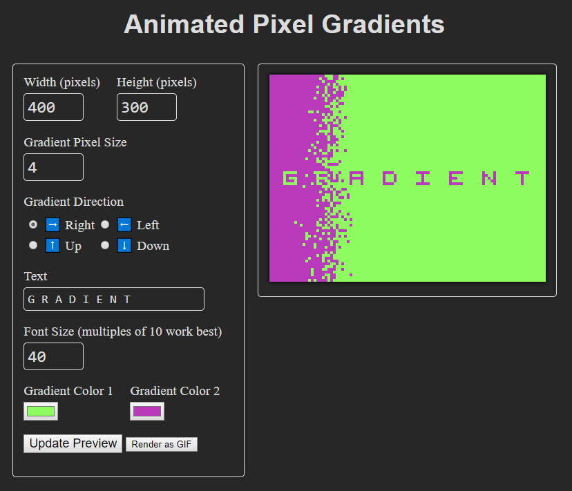
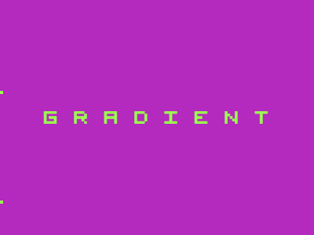

# animated-pixel-gradients
Make pixelated gradient GIFs with words on them!



**Example GIF**



[Live version on Glitch 🎏](https://animated-pixel-gradients.glitch.me/)

[Fork on GitHub](https://github.com/noahleigh/animated-pixel-gradients)

## Install from GitHub
```
git clone https://github.com/noahleigh/animated-pixel-gradients.git
cd animated-pixel-gradients
npm install
```
## Run locally
```
npm start
```
Open `http://localhost:PORT/` in your browser with the port that it provided (e.g. `http://localhost:8080/`)

## To Do
- Develop Twitter bot feature
